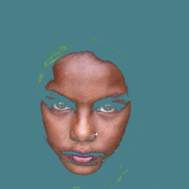
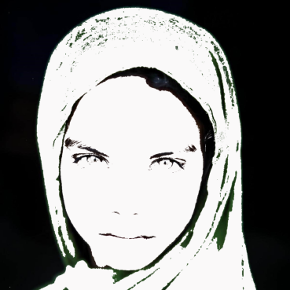

# A Color Extension to a String Art Algorithm

### Author: Yehya Albakri

#

## Abstract

This paper will investigate algorithms that are used to form string art. String art is a technique used to recreate an image by stretching a thread across pins on a canvas. This is usually done with a single thread. The challenge is optimizing the image such that minimal noise and visual artifacts are created while allowing the important features of the image to emerge.
 
 

Figure 1: an example representing images and their conversions to string art. [[1]](#link1)

There are many ways to optimize the placement of the strings, however, the most common one that will likely be used in this paper is an iterative greedy algorithm. This method starts at a random pin and chooses the darkest path in the image to follow and places a string, then moves to the end of the string.

Although such an algorithm is fascinating and the outcome resembles the provided image, allowing the algorithm to process colored images into a set of usable colored strings would have multiple benefits. The first benefit would be novelty and different aesthetic. The second is more retention of detail, at least in theory. Higher retention of detail would come from the fact that we can now overlay strings with different colors and hide their artifacts while simultaneously adding detail in that new color. There would be multiple ways to implement this idea which will be discussed in this paper, however, only one will be implemented and thoroughly examined.

The approach to recreating the original implementation should be fairly straight-forward. However, there are multiple challenges that arise from attempting a color implementation. They can be summarized into selecting the colors for the string(s), deciding how a greedy algorithm can be modified to work in a color image, and how the loss function will work. These modifications increase the complexity of the algorithm; there will be more parameters, and parameter tuning may become more crucial in attaining desirable results.

The outcome of the extension was successful (qualitatively judging) in transferring more information from the image to the art piece. It appears that the image has more depth and is separated into layers, each containing a different prominent color. At first glance, it is much easier to connect the resulting image to the original than the black and white version. However, the benefits do come with their vices in this case. There are some images where it is difficult for there to be a separation of colors using strings. An example of this is spots or any complex pattern. It seems to work best if the image appears to be divided into colors that are layered on top of each other.

## Experiment

This experiment intends to recreate a common string art algorithm that uses a greedy algorithm to iteratively decide which direction the string should take next. The extension this paper will pursue is applying that iterative algorithm in color. The experiment will be discussed in the following manner: the "replication" will be explained, then the extension will be explained in the context of the replication. As a note, the replication does not use any code from the papers referenced. The algorithm for the replication was implemented based on an understanding of the descriptions from the sources, so there may be some unaccounted discrepancies.

The replication takes in the following parameters: url, n_nodes, n_strings, and width.

- url refers to the link to the local image to be used for the algorithm.
- n_nodes refers to the number of "nails" that the string would be wrapping around if they were on a canvas.
- n_strings refers to the number of times the single thread of string will wrap around a nail (total sum for all nails on the canvas).
- width refers to the width of the string that is used. The value is unitless as it sets the width of a line plotted using the Matplotlib Python Library, however, the width is very relevant in translating the computer generated sequence of attachments to a real canvas. The conversion between this value and the actual width of a string to be used is unknown.

It starts by organizing n_nodes number of nodes uniformly in a circle. It provides each node with a set of coordinates that correspond to its location on the input image. The algorithm chooses a random node to start with. Using that node, it checks the mean brightness value between it and every other node, then moves in the path of the darkest value. The pixels under that line are then converted to white so that this line is avoided in future iterations. This operation is repeated n_strings times.

The color extension takes in the following parameters: url, n_nodes, n_strings, width, n_colors, and threshold. url, n_nodes, n_strings, and width have the same definition as the original implementation.

- n_colors represents the number of string colors to use.
- threshold represents the filtration threshold for the image to keep only the color of the string being optimized for. The meaning of the number will be explained later in more detail.

The extension starts by deciding which colors to use for the strings. Using a K-Means clustering algorithm, it is able to identify the top n_colors prominent colors. It is also able to provide a relative percentage value for how dominant each color is so that their sum is 1.

To judge the distance between two colors (the color of the string and the color of the pixel under it), we cannot use the pythagorean theorem. The reason being that our perception of color is not proportional to the distances resulting from the pythagorean theorem. There is another metric called the Delta E that is commonly used to understand how the human eye perceives color difference. Delta E is measured on a scale between 0 and 100, where 0 indicates a perfect color match and 100 indicates complete distortion. This is the metric that will be used to optimize the strings and to compare the final result to the original image. Another issue arises with how we match multiple colors to a single image; if one image is used, then it will be modified after the first colored string already modifies the image. The solution to this is to reset the original image after each color completes its turn. That way, each color will have a "fair" opportunity to optimize. There is one final optimization that seemed to make a difference in the quality of the result; sometimes the average distance (of colors) between the line and the pixels under it is closer in whitespace (large space of a solid color that does not match the color of the string) than it is to a small patch of the correct color in a larger space of opposing color. To remedy this, we introduced the 'threshold' parameter. This parameter identifies a delta E distance that when exceeded, will replace the pixel value with the inverse of the string color. This is done for each pixel in the image and for each color (one color for each time the image is reset).

#

The following is a sample image that will be used throughout the rest of the paper.

Figure 2: sample input image (Aysha)
  
If this image were to be used with the color algorithm, the following would be the output for the prominent colors of the image.

Figure 3: prominent colors of figure 1. Percent breakdown: green=0.4, black=0.44, and tan=0.15
  
These colors are then used to form the three images that the algorithm will run on.

  
  
  

Figure 4: images that will run on the string colors from figure 2
  

A problem that arose from having multiple colors was how to distribute the number of strings among each color and in what order to layer the colors (we want to keep the colors separate for convenience if forming this portrait in real life). Logically, the more prominent a color is, the more area of the image it takes up, and the more strings it requires. So, a solution is to divide the number of strings such that they are proportional to the percentage that each prominent color takes in the image. Other solutions may work better, but this factor was not experimented with. A factor that was experimented with was the ordering of colors in an image. In the case of Aysha, it seemed that having the least prominent colors be furthest in the back and the most prominent in the front worked best. Although this may seem a little counterintuitive, it worked because the less prominent colors are in the center of the image and created artifacts around the circumference as they filled in the center. The black background hides these artifacts if it goes on last. If the black background goes on first, artifacts start to emerge. It is possible that this is not a universal solution, and may need to be tuned depending on the image. But in the case of Aysha, it worked out well.

#

## Results

For a comparison to the original paper, an image of Popeye is run through the replication algorithm.

  

Figure 5: n_nodes=350, n_strings=3000, width=0.04

The image appears to resemble Popeye. The resemblance is not as strong as the comparison made in the original paper (figure 1), however, it is enough to verify that the replication algorithm is working.

<!--    -->

The following is a comparison of an image of Aysha run through the replication algorithm and an the same image run through the color algorithm.

  
  

Figure 6 (left): n_nodes=300, n_strings=1800, width=0.1

Figure 7 (right): n_nodes=500, n_strings=18000, width=0.03, n_colors=5, threshold=40

<!--    -->

It is (subjectively) noticeable that much more detail is preserved in the replication algorithm. However, there is a more objective metric that can be used to measure the distances between color images. the delta_E function from the Python colour library can also analyze distances between images. The following are the results: The Delta E between the the inputted Aysha image and the replication is 45.31, whereas the Delta E between the input image and the color extension is 26.68. There is a clear objective distinction between the quality of the images.

<!--    -->

For the replication algorithm, a visually decent result occurred within the range of 200-300 nodes and 1000-3000 string iterations. However, for the color algorithm, the number of strings required to make a visually decent image was on the order of 10000-20000, almost an order of magnitude greater. As a note, going above these ranges would not necessarily provide increased resolution in the image; at some point, the image just starts to become noisy. To understand this range (for the replication algorithm), we plotted the input image, but every time a string was extended, that line was removed from the image. A plot of the average distances between the color of the line (black), and the optimal direction the string should head in next was also plotted over time.

  
  

Figure 8: n_nodes=300, n_strings=1800, width=0.1

<!--    -->

It is noticeable that most of the dark spots in the Popeye image are gone, meaning that the replication algorithm did a decent job in extracting information from the image. The plot on the right in figure 7 represents the average distance between the black line and the line of the path it will be taking over the string iterations. This method is very useful in analyzing when it is a good time to stop adding more strings.

## Causes for Concern

There are multiple steps that the reference paper took to improve the accuracy of their string art. Many of these steps were not taken in the replication, which may or may not have a significant impact on the analysis. Additionally, we were only able to explore a small portion of the parameter space due to the computational power required for both of these algorithms (especially the color). For string ranges in 10000-20000, it takes upwards of 4-5 hours for a single run. As a result, there may have been the potential to tune the parameters such that the output images look significantly closer to the reference images. This is especially true for the color images since there are two additional tunable parameters of n_colors and threshold. This is not accounting for the new hidden parameters that have not been tuned much like the distribution of strings among colors, the ordering of the colors, and the method in which string colors are selected.

## Next Steps

The primary next step is to find a way to algorithmically tune the parameter space to optimize the resulting image quality. The possible quality improvements, even for the images in this paper, is unknown.

Another next step which was not discussed in this paper is tuning the placement of the "nails" (nodes). Their position was taken in as an assumption from the reference paper, but it is possible that introducing nodes in new placement patterns can significantly improve the quality of the resulting string art. These placement patterns could be a preset variable or something that is calculated algorithmically.

With all the potential spaces to be explored for improvement, this paper has only scratched the surface of the realm of achievable string art.

#

## Annotated Bibliography

### **String art: towards computational fabrication of string images**

Birsak, Michael; Rist, Florian; Wonka, Peter; Musialski, Przemyslaw

This paper examines the concept of recreating an image in the form of string art. The approach they use is similar to an agent-based model, where there are nodes, aligned equidistantly in a circle. The string (the agent) starts at a random node and iteratively makes the decision to go in the direction of the darkest path. After a number of iterations, resemblance to the original image starts to emerge. However, within this one problem they solve, they encounter other problems they need to solve. The first one is defining a frame of nodes that will contain the new image. The nodes need to correspond to pixel positions on the reference image. The second one is sampling pixels from under a line, as mentioned earlier. The third one is eliminating visual artifacts which may emerge patterns of intersecting lines. In conclusion, their approach was successful in forming string art that has a strong resemblance to the reference image. They also found that the method works on some images better than others. For example, if there is a face with high contrast between light areas and dark spots, some visual artifacts emerge.

## References

<a name="link1">[[1] Birsak, Michael; Rist, Florian; Wonka, Peter; Musialski, Przemyslaw. 22 May 2018. String Art: Towards Computational Fabrication of String Images.](https://repository.kaust.edu.sa/bitstream/10754/656489/1/2018.EG.Birsak.StringArt.pdf)</a>

## Sources

http://zschuessler.github.io/DeltaE/learn/#:~:text=Delta%20E%20is%20a%20metric,range%20from%200%20to%20100
https://mymodernmet.com/mou-aysha-humanitarian-photography/
https://www.youtube.com/channel/UCqvXAiNyn8pd9SVPclWfJTg
