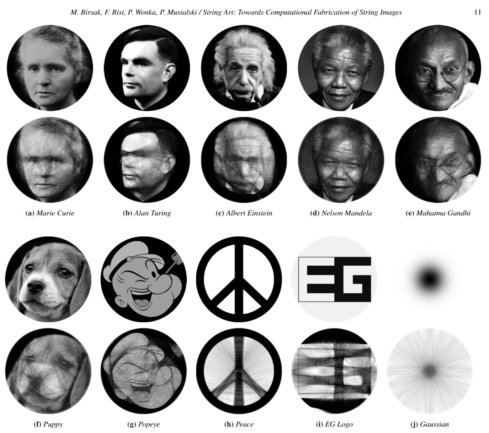

# A Color Extension to String Art Algorithms

### Yehya Albakri

#

## Abstract

This paper will investigate algorithms that are used to form string art. String art is a technique used to recreate an image by stretching a thread across pins on a canvas. This is usually done with a single thread. The challenge is optimizing the image such that minimal noise and visual artifacts are created while allowing the important features of the image to emerge.
 
 

above is an example representing images and their conversions to string art. [[1]](#link1)

There are many ways to optimize the placement of the strings, however, the most common one that will likely be used in this paper is an iterative greedy algorithm. This method starts at a random pin and chooses the darkest path in the image to follow and places a string, then moves to the end of the string.

Although such an algorithm is fascinating and the outcome resembles the provided image, allowing the algorithm to process colored images into a set of usable colored strings would have multiple benefits. The first benefit would be novelty and different aesthetic. The second is more retention of detail, at least in theory. Higher retention of detail would come from the fact that we can now overlay strings with different colors and hide their artifacts while simultaneously adding detail in that new color. There would be multiple ways to implement this idea which may be explored in this paper. This may be explored as a further extension to this paper.

The approach to recreating the original implementation should be fairly straight-forward. However, there are some problems which may require the use of external libraries. The main one is finding the pixels that are underneath a line between two points. This problem is essentially converting continuous to discrete. A library that may be helpful in simplifying this process is scikit-image.

## Annotated Bibliography

### **String art: towards computational fabrication of string images**

Birsak, Michael; Rist, Florian; Wonka, Peter; Musialski, Przemyslaw

This paper examines the concept of recreating an image in the form of string art. The approach they use is similar to an agent-based model, where there are nodes, aligned equidistantly in a circle. The string (the agent) starts at a random node and iteratively makes the decision to go in the direction of the darkest path. After a number of iterations, resemblance to the original image starts to emerge. However, within this one problem they solve, they encounter other problems they need to solve. The first one is defining a frame of nodes that will contain the new image. The nodes need to correspond to pixel positions on the reference image. The second one is sampling pixels from under a line, as mentioned earlier. The third one is eliminating visual artifacts which may emerge patterns of intersecting lines. In conclusion, their approach was successful in forming string art that has a strong resemblance to the reference image. They also found that the method works on some images better than others. For example, if there is a face with high contrast between light areas and dark spots, some visual artifacts emerge.

## Experiment

The main experiment I intend to do is to recreate the algorithm that forms string art from an inputted image. However, there are multiple extensions that can be explored in the process. The extension will be chosen depending on the difficulty of replication of the original algorithm. An idea for an extension on the easier end would be to see if changing the color of the thread would have an effect on feature retention on the image. An extension on the more difficult end would be to attempt to implement a similar algorithm, but allow it to run with multiple colors simultaneously. There are multiple ways of approaching the latter. The first is dividing the image into its three RGB channels, and running an independent string for all three colors and either run all three colors simultaneously or stack the three RGB thread images on top of each other. Another method is selecting the prominent colors in the image and layering them by prominence, with each color running on a channel filtered by the color.

## Results

The results will mainly look like input images and output images, attempted with multiple parameters of node and iteration lengths. Other results can include modifications to improve potential visual artifacts that may emerge.

## Causes for Concern

My main concern is that since replication will be the most difficult step, I may have to aim for the easier end of the extension. My worry about this is that I may not get insightful results. However, I believe that my theory about changing the color of the string (and the color extracted from the image) may have an interesting effect on the features extracted by the algorithm. My other concern is that I may have a difficult time converting a continuous line between two points into discrete pixels. I have an idea for the direction to take this, but no solid plan on what I will be doing.

## Next Steps

What I can start working on is creating the object that contains the ring of equidistant nodes. Afterwards, I will overlay it on the image, and assign coordinates to each node. This will form the framework on which the rest of the algorithm will run. My challenge after this is converting the pixels along the line between any two nodes into coordinates. Then I will have access to these pixels and will be able to form my own selection method for which path the string will take at each node. Achieving these steps will be my goal for the first week.

## References

<a name="link1" href="https://repository.kaust.edu.sa/bitstream/10754/656489/1/2018.EG.Birsak.StringArt.pdf" target="blank">[1] Birsak, Michael; Rist, Florian; Wonka, Peter; Musialski, Przemyslaw. 22 May 2018. String Art: Towards Computational Fabrication of String Images.</a>
